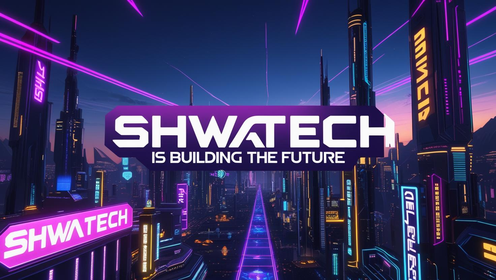

# End-To-End-Gemstone-Price-Prediction-MLOps-Pipeline

This Is An End-To-End Machine Learning Operation Pipeline For Gemstone-Price-Prediction Starting from Project Setup, Git, Docker, MLOps Tools, Modular Coding, MLFlow, DVC, Airflow and Deployment



## Create Project Structure

```bash
python template.py
```

## Creating a Conda env, Activate it and Istall Requiremnets

```bash
bash init_setup.sh
```
