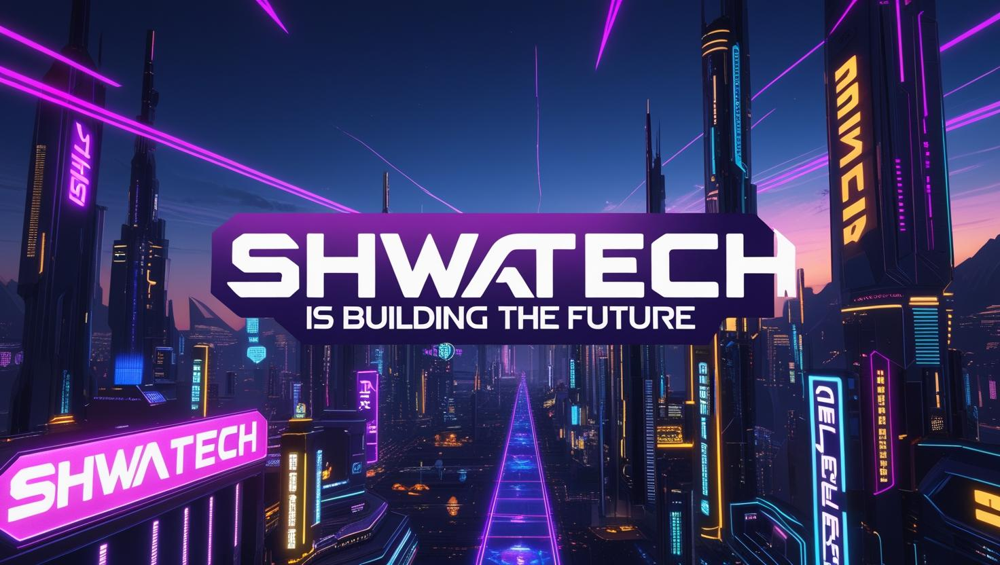

# End-To-End-Gemstone-Price-Prediction-MLOps-Pipeline

This Is An End-To-End Machine Learning Operation Pipeline For Gemstone-Price-Prediction Starting from Project Setup, Git, Docker, MLOps Tools, Modular Coding, MLFlow, DVC, Airflow and Deployment



## Create Project Structure

```bash
python template.py
```

## Creating a Conda env, Activate it and Istall Requiremnets

```bash
bash init_setup.sh
```

## Run The Flask App To Predict Gemstone Price

```bash
python app.py
```

[Local Host](http://localhost:8000)

## How To Migrate Data Version Control DVC

```bash
dvc init

git status
# new file:   .dvc/.gitignore
# new file:   .dvc/config
# new file:   .dvcignore

git commit -m "Initialize DVC"
```

### Create a dvc.yaml File and Add Your Code Then

```bash
dvc repro
```

```bash
dvc remote add -d myremote dvcstore
```

```bash
dvc push
```

```bash
dvc dag
```
